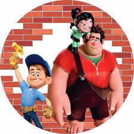

# 🎮 **JSGame Detona Ralph**

<p align="center">
  
</p>

Bem-vindo ao **JSGame Detona Ralph**!  
Este jogo é inspirado no icônico filme *Detona Ralph* e foi desenvolvido para demonstrar técnicas avançadas de desenvolvimento em **JavaScript**, além de oferecer uma experiência de diversão interativa.

---

## 🚀 **Tecnologias Utilizadas**

- **HTML5** e **CSS3**: Estrutura e estilo visual do jogo.  
- **JavaScript**: Lógica, interatividade e mecânicas do jogo.  
- **Sprites e imagens customizadas**: Recriando o universo visual do *Detona Ralph*.  

---

## ✨ **Funcionalidades**

- **Sistema de Pontuação**: Colete pontos clicando no quadrado onde o Ralph aparece.  
- **Gameplay Dinâmico**: Mova o personagem e interaja com o cenário.  
- **Desafios Crescentes**: Teste sua habilidade e tente superar sua própria pontuação!  

---

## 🎮 **Como Jogar**

1. Faça o clone deste repositório para sua máquina local:
   ```bash
   git clone https://github.com/seu-usuario/jsgame-detona-ralph.git
   ```
2. Abra o arquivo `index.html` em seu navegador.  
3. **Objetivo**: Clique no quadrado onde o Ralph aparece para marcar pontos!  
4. Divirta-se enquanto desafia seus reflexos e habilidades.  

---

## 🤝 **Como Contribuir**

Contribuições são super bem-vindas!  
Se você deseja:
- Melhorar o jogo.
- Corrigir bugs.
- Adicionar novas funcionalidades.  

Siga os passos abaixo:  
1. Faça um fork deste repositório.  
2. Crie uma nova branch:  
   ```bash
   git checkout -b feature/nova-funcionalidade
   ```
3. Submeta suas mudanças com um _pull request_.  

---

## 📜 **Créditos**

Este jogo foi desenvolvido como parte de um projeto educacional na **Digital Innovation One**.  

Confira o repositório original [aqui](https://github.com/digitalinnovationone/jsgame-detona-ralph) e não esqueça de deixar uma ⭐️ se gostou!  

---

🎉 **Divirta-se jogando e desafie seus amigos!**

